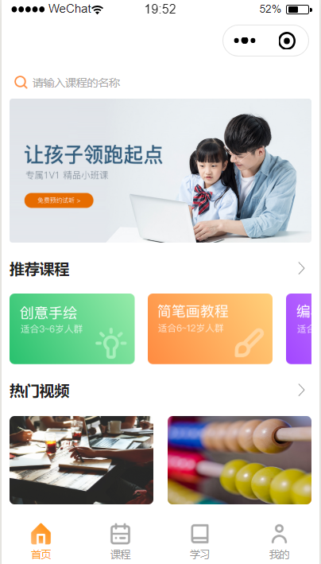
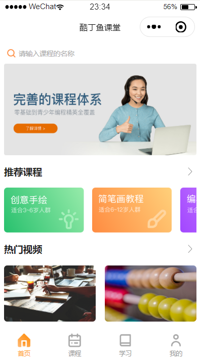
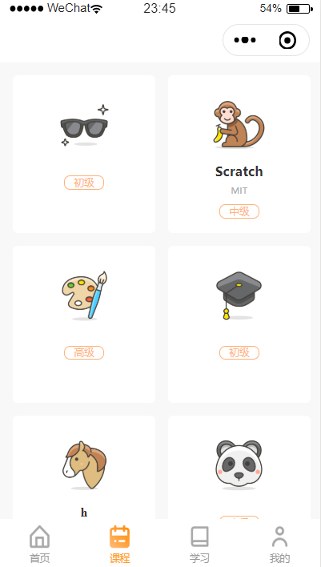
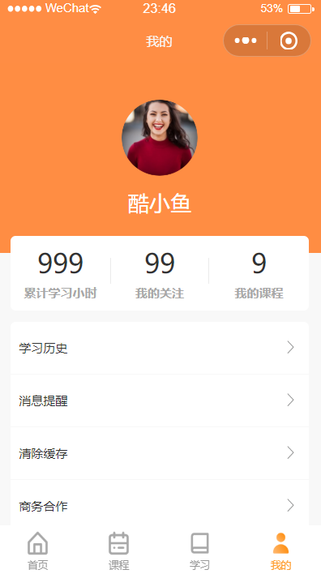
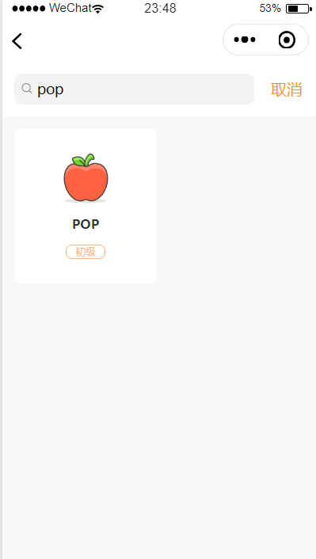

## 蘑菇在线项目演示



1. 登录页：微信授权登录
2. 手机登录页：手机号登录
3. 首页：展示推荐轮播图、推荐课程及热门视频
4. 课程：展示课程列表
5. 学习: 展示学习记录
6.  我的：展示用户信息

## 项目说明

1. 后面node.js项目地址 https://gitee.com/jovenwang/mushroom-online-server
2. 微信小程序前端完成项地址 https://gitee.com/jovenwang/mp-mushroom-online
   1. 完整项目在分支 master
   2. 静态页面在分支 Fea_static_pages
3. 接口API https://gitee.com/jovenwang/mushroom-online-server/blob/master/api.md
4. 设计稿 https://lanhuapp.com/url/8NzGu-m2LY3


## 项目准备

后台准备

1. 数据库初始化
2. 配置后台
   1. appid换成我们自己申请的
   2. appsecret也是
3. server启动
4. 测试后端接口能否调用
   1. http://localhost:3000/api/user/vcode?phone=15361819220
5. 新建微信小程序项目
   1. 项目名`mp-mushroom-online`
   2. 新建login页面，删除多余页面
   3. app.js和app.wxss内容重置


## 项目git管理

1. 码云新建仓库名`mp-mushroom-online`
2. 按提示推送代码
3. 新建开发分支`Fea_joven_20`

## 登录页-页面分析


1. 小程序的入口
2. 微信授权登录
3. 手机号码登录跳转到手机登录页面


## 自适应单位rpx 

[传送门](https://developers.weixin.qq.com/miniprogram/dev/framework/view/wxss.html#%E5%B0%BA%E5%AF%B8%E5%8D%95%E4%BD%8D)

1. 所有设备的宽度都是750rpx。相当于所有设备的宽度750等分，每一份是1rpx

2. 开发微信小程序时设计师用 iPhone6 作为视觉稿的标准，宽度是750px

   1. **代码里面的元素rpx值=设计稿对应元素的像素值**
   2. 设计的宽度就是750px,iphone6的2倍图

3. 需要随屏幕尺寸变化的元素用rpx, 否则用px

   1. 实际项目里面，哪些元素是固定尺寸的，看实际情况

4. 实际开发中，一般只需要用rpx适配好iphone6就行。

5. 哪些css属性需要自适应

   1. margin
   2. padding
   3. border
   4. font-size
   5. width,height


## 登录页-静态页面

1. logo展示
2. 文案展示
3. 微信授权按钮展示
4. 手机号码登录和商标展示
5. 点手机号码登录，跳转到手机登录页面
   1. 声明式navigator组件


## 小程序授权

[授权](https://developers.weixin.qq.com/miniprogram/dev/framework/open-ability/authorize.html)

部分接口需要经过用户授权才能调用，比如说获取用户信息、通讯地址、微信运动步数等等

#### 授权行为：

1. 第一次发起授权某权限，会弹窗请求权限，用户同意后会调用接口
2. 如果用户已经授权，直接调用
3. 如果用户已经拒绝，直接进入失败。


#### 基本使用（基本上对于每个授权使用都一样）

1. 先用getSetting获取用户授权的状态，如果拒绝的话，提示打开设置允许

2. 否则的话，使用`wx.authorize`发起授权，就会授权弹窗，再调相应接口获取信息

   

#### 注意点：

1. 用户信息的授权用`<button open-type="getUserInfo">用户信息</button>`, 即使用户拒绝也会弹出授权。

2. ```js
   <button open-type="getUserInfo" bindgetuserinfo="getuf">用户信息</button>
   ```

3. openSetting打开界面查看到各个授权的状态

4. getSetting也可以得到各个授权状态的数据，程序员使用

5. 在手机微信里面，...点击去到设置里面，可以看到授权状态

6. 学会了基本的授权使用，其他接口随用随查，不需要立马掌握


## 登录页-用户信息授权

1. 点击`微信授权登录`按钮，弹出授权窗口，获取授权信息
   1. 获取用户信息必须用声明式，不破坏之前的样式
      1. 样式绝对定位
      2. 透明
   2. 设置button属性
      1. open-type="getUserInfo"
      2. bindgetuserinfo="wxLogin"
      3. wxLogin里面获取到用户信息
   3. 弹窗用户拒绝处理，提示`登录失败，请授权`


## 小程序登录

[传送门](https://developers.weixin.qq.com/miniprogram/dev/framework/open-ability/login.html)

第三方登录：第三方网站授权登录

其实就是用微信账号登陆小程序

步骤：

1. 获取用户信息, 如果没有授权过，会在底部弹出授权窗口的

   ```html
   <button open-type="getUserInfo"
               bindgetuserinfo="getuserinfo">点我登录</button>
   ```

2. wx.login()获取到code

3. 调后端接口获取token

   1. /user/wxlogin


## 异步请求wx.request

[传送门](https://developers.weixin.qq.com/miniprogram/dev/api/network/request/wx.request.html)

基本XMLHttpRequest封装的

> 豆瓣API :   https://api.douban.com/v2/movie/in_theaters?apikey=0df993c66c0c636e29ecbb5344252a4a

使用方法基本和$.ajax一样

```js
wx.request({
    url: 'https://api.douban.com/v2/movie/in_theaters',
    method: 'GET',
    data: {
        apikey: '0df993c66c0c636e29ecbb5344252a4a'
    },
    // 看实际情况是否需要写content-type
    header: {
        'Content-Type': 'application/x-www-form-urlencoded'
    },
    dataType: 'json',
    success: res => {
        console.log(res)
    }
})
```


看实际情况是否需要写content-type

```js
header: {
  'Content-Type': 'application/x-www-form-urlencoded' // 默认值
}
```


## 设置合法域名

[传送门](https://developers.weixin.qq.com/miniprogram/dev/framework/ability/network.html)

小程序里面请求的后端服务器，需要在小程序后台注册域名

服务器域名请在 「小程序后台-开发-开发设置-服务器域名」 中进行配置

手机扫码默认也会检查安全域名，...->开发调试->打开调试，就不会检查安全域名了

#### 注意点

1. 微信小程序在开发的时候，可以通过勾选不检验合法域名来解决域名安全的问题，但是上线前一定需要配置合法域名。


## 登录页-用户登录

1. 点击`微信授权登录`按钮，弹出授权窗口，用户点确定，登录后提示`登录成功`
   1. wxLogin获取用户信息，再获取用户登录凭证，调接口登录
      1. 用户登录凭证 wx.login()
      2. 登录接口
         1. url :/user/wxlogin
         2. 方法 POST
         3. data:{code,nickname,avatar}
      3. 登录成功
         1. 提示微信登录成功
         2. 跳转到首页


## Loading效果

[showLoading](https://developers.weixin.qq.com/miniprogram/dev/api/ui/interaction/wx.showLoading.html)

1. wx.showLoading与wx.hideLoading是显示与隐藏loading提示框
   1. title提示的内容
   2. mask loading中是否能操作mask以下
2. wx.showNavigationBarLoading与wx.hideNavigationBarLoading  在当前页面显示导航条加载动画 


## 登录页-添加Loading效果

1. 请求前开启loading
2. 请求后complete钩子里面关闭loading


## 数据存储

[传送门](https://developers.weixin.qq.com/miniprogram/dev/api/storage/wx.setStorageSync.html)

1. 浏览器的本地存储

   1. localStorage（关闭浏览器后还存在）
   2. sessionStorage(关闭浏览器后不存在)
   3. 区别，使用，大小限制，存储类型？？？
      1. setItem(key,string),removeItem,getItem,clear
      2. 存储类型只能是字符串
      3. 5M

2. 小程序

   1. wx.setStorage,wx.getStorage....

   #### 01.存数据

   建议用setStorageSync

   本质是存数据是异步的，API上有同步和异步之分

   ```js
   // 异步存储
   wx.setStorage({
      key: 'name',
      data: 'Joven',
     success:function(){
       // 这里存储成功
     }
   })
   // 建议用同步存储
    wx.setStorageSync('age', 28)
   ```

> AJAX的A是Async
>
> fs.readFileSync


#### 02.取数据

建议用getStorageSync

```js
// 异步取数据
wx.getStorage({
  key: 'name',
  success: function(res) {
    console.log(res)
  }
})
// 建议用：同步取数据
console.log(wx.getStorageSync('age'))
```

> getStorageInfo是用来获取storage所有的信息的

#### 03.清除数据

1. clearStorageSync 清除所有数据

2. 删除指定项数据

   ```js
   // 异步删除指定key的数据
   wx.removeStorage({
     key: 'name',
     success: function(res) {
       console.log(res)
     },
   })
   // 同步删除指定key的数据
   wx.removeStorageSync('name')
   ```


#### 04.总结

1. 小程序的storage其实是对手机存储系统的文件读取，所以是异步的

2. 小程序的存储可以是复杂类型，JSON.parse能够解析的

3. 单个 key 允许存储的最大数据长度为 1MB，所有数据存储上限为 10MB 

   >内存，速度快，断电会丢失存储，价格贵，容量偏小
   >
   >硬盘，SSD，速度偏慢，断电不会丢失，价格相对便宜，容量大。


## 登录页-存储token

1. 登录成功，存储token

1. 存储方法setStorageSync
2. key值 token


## 复习Promise

1. 回顾promise的学习

   1. 是什么？ 

      1. 表示一个异步操作，一个数组存了一些异步操作

   2. 有什么用

      1. 管理异步操作
      2. 解决回调地狱问题，让代码更优雅。不用写回调函数，.then

   3. 如何使用

      1. 创建对象

         ```js
         var p = new Promise((resolve,reject)=>{
           // 逻辑代码
           if(){
              resolve(data)
           }else{
             reject(err)
           }
         })
         ```

      2. 使用promise对象

         ```js
         p.then(res=>{
           console.log(res)
         }).catch(res=>{
           console.log(res)
         })
         ```


####  Promise主要用管理异步对象的

1. Promise.all 所有的异步操作都完成，才成功
2. Promise.race 和第一个完成的异步操作状态一样

```js
let isA = false
let isB = false

a({
  success(){
    isA = true;
    if(isA &&isB){
      doC()
    }
  }
})

b({
  success(){
    isB = true;
    if(isA &&isB){
      doC()
    }
  }
})
```


## 登录页-wx.request的封装

1. 初步封装
   1. 新建utils/request.js文件
   2. request.js中声明并exports request方法
   3. request方法逻辑和登录页wx.reqest逻辑一致
   4. login/index.js中引入request.js并使用
2. request方法接受传参{url,method,data}
3. 提取基地址
4. 请求前开启loading，请求后关闭loading
5. request方法中使用解构并赋默认值
6. 成功返回的数据，判断status===0, 再resolve数据
7. 使用async和await

   1. await作用是返回promise对象then里面的数据
   2. async作用有await的代码的function必须用async修饰
   3. **需要`增强编译`**


## 手机号登录页-页面分析


1. 从登录页，点击`手机号码登录`跳转到当前页面
2. 用户输入手机号，点击`获取验证码`按钮，按钮倒计时从10开始，请求获取验证码后toast出来
3. 输入toast出来的验证码，点击立即验证，完成手机号码登录


## 组件Input

[传送门](https://developers.weixin.qq.com/miniprogram/dev/component/input.html)

基本概念：输入框

用法基本和html input标签一样

特点：

1. 默认没有边框
2. type键盘类型
   1. 默认类型是text
   2. number数字键盘
   3. idcard有一个X键
3. confirm-type 键盘右下角按钮的文案
   1. search 搜索

如何获取输入框中的内容

1. 添加input事件 bindinput
2. 事件处理方法里面，**event.detail.value**即是用户的输入
3. 小程序没有v-model

确认事件 bindconfirm

> 微信开发者工具不稳定，无法触发bindinput，只是调试基础库2.9.3


## 手机号登录页-获取验证码

1. 获取用户输入的手机号码
   1. data声明phoneNumber
   2. input框`bindinput`事件:getPhoneNumber
   3. 事件处理方法中event.detail.value, setData设置
2. 点击`获取验证码`按钮，并开始倒计时
   1. 按钮注册事件bindtap="getVcode"
   2. 正则表达式判断`/^1[3456789][0-9]{9}$/`,如果手机号不合法，toast提示，并返回
   3. 添加data属性isCountdown
      1. 开始倒计时，设置isCountdown:true
      2. 根据isCountdown设置按钮颜色和文案
   4. 开启倒计时，添加count属性
      1. 设置定时器count--, 并设置count
      2. count小于0
         1. 结束timer，定时器设置为全局变量
         2. count:10, isCountdown:false
   5. 倒计时中，返回
3. 点击`获取验证码`按钮，发请求，获取验证码,并toast
   1. 接口
      1. url:/user/vcode
      2. data:{phone}
   2. toast


## 手机号登录页-点立即验证完成登录

1. 获取用户输入的验证码
   1. data声明vcode
   2. input框`bindinput`事件:getInputVcode
   3. 事件处理方法中event.detail.value, setData设置
2. 击`立即验证`按钮，请求接口，完成登录
   1. 按钮注册事件bindtap="phoneLogin"
   2. 正则表达式检验手机号码
   3. 正则表达式检验vcode `/^[0-9]{4}$/`
   4. 请求接口
      1. url:/user/login
      2. method:post
      3. data:{phone,vcode}
   5. toast提示，存储token，跳转首页
   6. 清除定时器
      1. onUnload


## 首页-页面分析



1. 完成登录后，用户跳转的页面; 已登录用户启动小程序，打开的第一个页面
2. tab栏由4个页面组成: 首页，课程，学习，我的，点击首页tab去到首页
3. 首页顶部`搜索区域`不可以输入，点击跳转到搜索页面
4. 首页由搜索区域+轮播图+推荐课程+热门视频组成

## Tab栏配置

[传送门](https://developers.weixin.qq.com/miniprogram/dev/reference/configuration/app.html#tabBar)

app.json的tabBar属性配置Tab栏，点击不同tab显示对应的页面

使用方法：在app.json里面配置

```js
 "tabBar": {
     // tab未选中时的文字颜色
     "color": "#0000ff",
      // tab选中时的文字颜色
      "selectedColor":"#eb4450",
      "list": [
        {
          // tab选中时显示的页面路径
          "pagePath": "pages/index/index",
          // tab的文案
          "text": "首页"，
            iconPath  ，
            selectedIconPath
            
        }
     }
}
```


## 首页-Tabbar栏配置

1. 新建四个页面home,course,study,my
2. copy文档tabBar配置，修改四个tab的文案
3. 设置selectedColor:  tab 上的文字选中时的颜色 
4. 设置iconPath  没选中时图片路径 
5. 设置selectedIconPath 选中时图片路径


## 首页-渲染页面

1. 注意wx:for key的正确设置


## 课程-页面分析




## 课程-渲染页面


## 我的-页面分析 



## 我的-渲染页面


## 搜索-页面分析




## image组件的mode属性

 图片裁剪、缩放的模式 ,类似于background-size:cover

​	[传送门](https://developers.weixin.qq.com/miniprogram/dev/component/image.html)

1. 默认是scaleToFill:拉伸
2. aspectFit：保持宽高比，长边显示出来
3. aspectFill:保持宽高比，短边显示，长边截取
4. widthFix:保持宽高比，宽度不变，高度自动变化

如果需要显示的图片和image的宽度和高度比例是一致的话，无论什么模式效果是一样的。


## Tab栏切换

1. 只有配置在tabBar中的页面才有tab栏
2. 页面跳转
   1. 跳转到tab页面用`switchTab`
   2. 跳转到非tab页面用`navigateTo`
